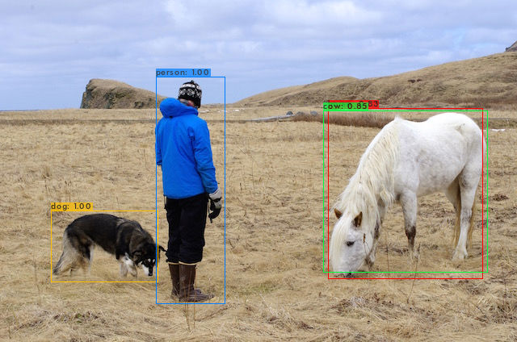
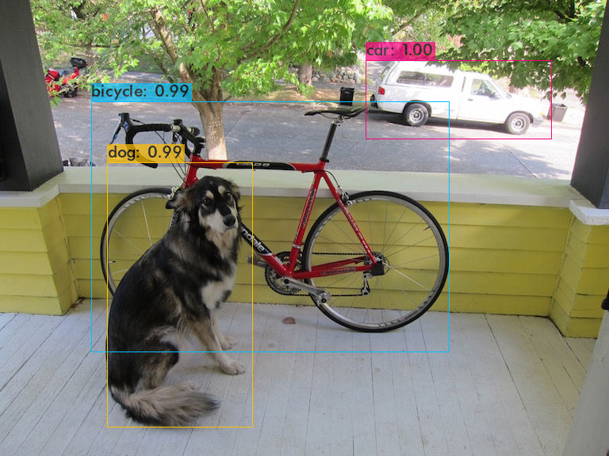
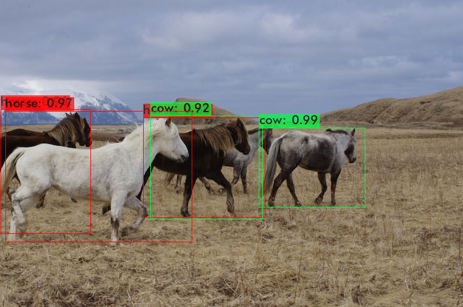
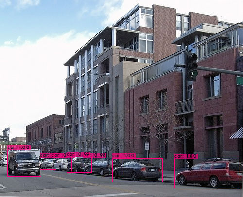

# YOLOV4_Train_PyTorch
1000行代码完美复现YOLOV4的训练和测试，精度、速度以及配置完全相同，两者模型可以无障碍相互转换。

## 指标展示
|Model| train | test | mAP@0.5 | mAP@0.75 | FPS |
|-----|------|------|-----|-----|-----|
|yolov4(train from Darknet-AlexeyAB) | 0712 |	2007_test |	86.05 |	67.09 |	55 |
|**yolov4(ours)** | 0712 |	2007_test |	**86.85** |	**68.14** |	**55** |
|**yolov4(yolov5-loss)** | 0712 |	2007_test |	**88.74** |	**74.93** |	**55** |
|**yolov4(yolov5-loss + ema)** | 0712 |	2007_test |	**89.22** |	**74.96** |	**55** |

## 效果展示
      
      

## 使用说明
### 要求
> Python >= 3.6 \
> PyTorch >= 1.4
### 数据集下载
```shell script
cd <path-to-voc>/
wget https://pjreddie.com/media/files/VOCtrainval_11-May-2012.tar
wget https://pjreddie.com/media/files/VOCtrainval_06-Nov-2007.tar
wget https://pjreddie.com/media/files/VOCtest_06-Nov-2007.tar
tar xf VOCtrainval_11-May-2012.tar
tar xf VOCtrainval_06-Nov-2007.tar
tar xf VOCtest_06-Nov-2007.tar
```
### 数据生成
```shell script
cd data/voc0712
python voc_label.py
cat 2007_train.txt 2007_val.txt 2012_*.txt > train.txt
```
### 预训练模型下载
```shell script
cd pretrain
wget https://github.com/AlexeyAB/darknet/releases/download/darknet_yolo_v3_optimal/yolov4.conv.137
```
### 训练和测试
```shell script
python train.py
```
已训练好的模型：[百度云(提取码:8888)](https://pan.baidu.com/s/1_UVJ_XSYfsGFA3GZVZ52Rw)
```shell script
python detect.py
```
### 计算mAP
模型转换至darknet
```shell script
python cvt2darknet.py
```
编译原始版本[darknet](https://github.com/pjreddie/darknet)
```shell script
./darknet detector map cfg/voc.data cfg/yolov4-voc.cfg weights/yolov4-140.weights
```

## 复现重点
- 添加`burning in`和`one circle scheduler`
- 添加`mosaic`数据增强，`resize`替换`letter_box`
- 完全复现`darknet-yolo_layer`的`loss`计算方式
  <br>1. 负样本：每个`grid_cell`的3个`bbox`与所有`target`的`iou<0.7`，且不属于正样本`bbox`的下标，**同时添加了`compare_yolo_class`**
  <br>2. 正样本：每个`grid_cell`的3个`anchors`与`targets`最大`iou`的下标
  <br>**3. 每个`anchor`可以分别预测多个`targets`，并不是只有一个，且每个`anchor`可预测多个`class`**
  <br>**4. 正样本`confidence`的`target`为1，不是iou**
  <br>**5. 正样本`bbox`回归的损失函数为`CIoULoss`**
  <br>**6. 添加非绝对正样本**
  <br>**7. 添加`average classes in on box`**

## 参考
https://blog.csdn.net/samylee  
https://github.com/AlexeyAB/darknet
